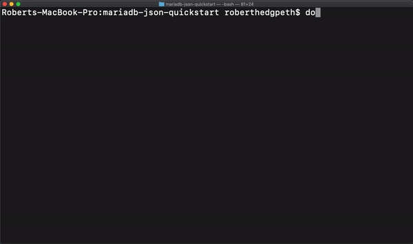
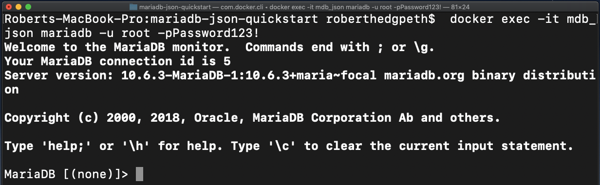

# MariaDB JSON Quickstart

This repository uses the [official MariaDB Docker image](https://hub.docker.com/_/mariadb) to demonstrate how to manage semi-structured, via [JavaScript Objection Notation (JSON)](https://www.json.org/json-en.html), within a [MariaDB](https://mariadb.com) database. 

<p align="center" spacing="10">
    <kbd>
        
    </kbd>
</p>

This README will walk you through the steps for getting a MariaDB database up and running, using a [Docker container](https://www.docker.com/resources/what-container), and automatically create a [database, table and pre-load the table with data](database/places.sql). 

## Requirements 

This sample requires that you have the following installed:

* [Docker](https://docs.docker.com/get-docker/) 

## Setup Instructions

The following provides for getting started using JSON with MariaDB (via a MariaDB database instance within a Docker container).

1. Pull down this respository by either downloading it directly or use [git](git-scm.org) (through CLI or a client) to retrieve the code using `git clone`:

    ```
    $ git clone https://github.com/mariadb-developers/mariadb-json-quickstart.git
    ```

2. Navigate to the root of this sample, and execute the [docker-compose up](https://docs.docker.com/compose/reference/up/) command to run [docker-compose.yml](docker-compose.yml):

    ```bash 
    $ docker-compose up -d
    ```

    **Note:** The `docker-compose up` command will use the [docker-compose.yml](docker-compose.yml) file to spin up a new Docker container (using the official MariaDB Docker image) and [execute SQL](data/places.sql) to create a new database (`places`), tables (`locations`), and load it with sample data.

    
3. Use the `docker` CLI command to use the `mariadb` command-line client, included in the Docker container, to connect and query your MariaDB database.

    ```bash 
    $ docker exec -it mdb_json mariadb -u root -pPassword123!
    ```

    which will load the MariaDB command-line client, which will enable to start executing SQL using MariaDB JSON functionality. 

    <p align="center" spacing="10">
        <kbd>
            
        </kbd>
    </p>

## Helpful Resources

* [Official MariaDB JSON documentation](https://mariadb.com/docs/appdev/json/#json)
* [Getting Started with JSON and MariaDB](https://medium.com/mariadb/hybrid-data-models-how-to-have-your-json-cake-and-eat-mariadb-too-ee809604d1f1) (blog post)

## Support and Contribution <a name="support-contribution"></a>

Please feel free to submit PR's, issues or requests to this project project directly.

If you have any other questions, comments, or looking for more information on MariaDB please check out:

* [MariaDB Developer Hub](https://mariadb.com/developers)
* [MariaDB Community Slack](https://r.mariadb.com/join-community-slack)

Or reach out to us diretly via:

* [developers@mariadb.com](mailto:developers@mariadb.com)
* [MariaDB Twitter](https://twitter.com/mariadb)

## License <a name="license"></a>
[](https://opensource.org/licenses/MIT)